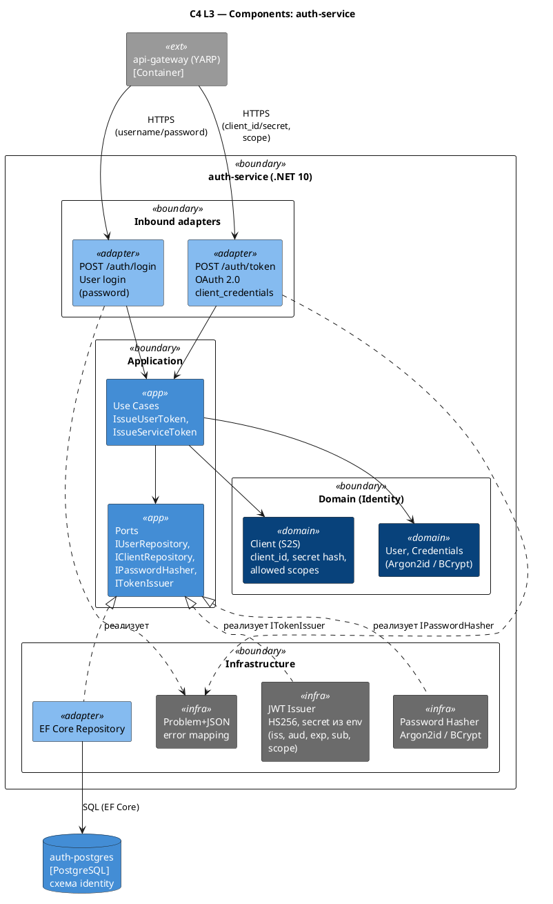

# C4 Component — auth-service

Источник: ADR-0021, ADR-0022, AR-0012

## Описание

Внутреннее устройство `auth-service` — единственного issuer JWT. Содержит два публичных эндпоинта: `/auth/login` (пользовательский логин по password) и `/auth/token` (OAuth 2.0 `client_credentials` для S2S). Доменный bounded context `Identity` (Users, Clients, Credentials) живёт за гексагональными портами; подпись JWT — инфраструктурная задача (HS256, секрет из конфигурации).

## Диаграмма

