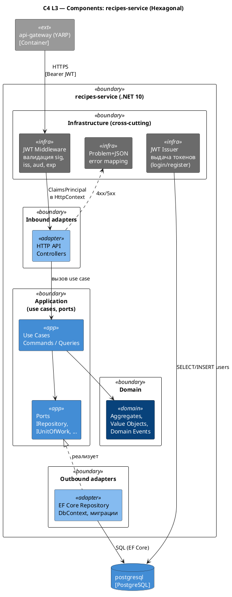

# C4 Component — Backend (recipes-сервис)

Источник: ADR-0011, ADR-0012, ADR-0013, ADR-0014, ADR-0035, AR-0006, AR-0007, AR-0013

## Описание

Внутреннее устройство `recipes`-сервиса в гексагональной архитектуре. Domain (агрегаты, VO, доменные события) изолирован от инфраструктуры; Application определяет use-cases и порты. Auth-модуль — инфраструктурный cross-cutting слой: JWT-middleware, issuer и хранение пользователей. Не является доменным портом/адаптером.

## Диаграмма

