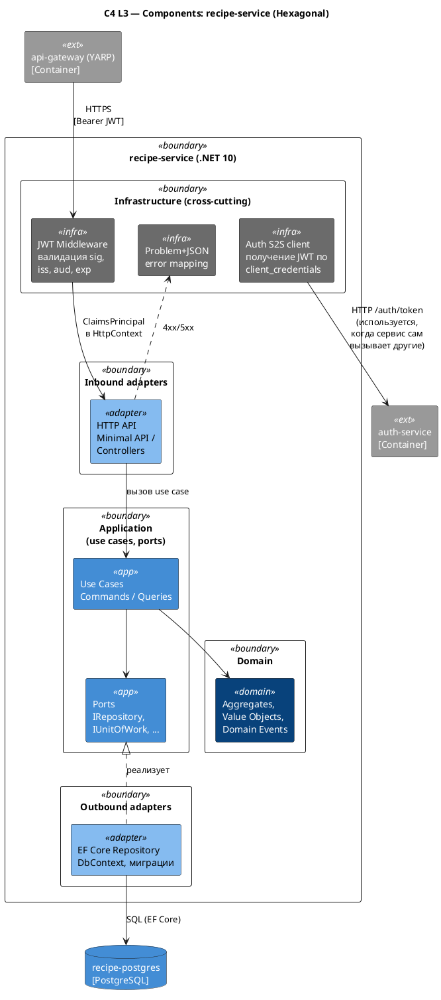

# C4 Component — Backend (доменный сервис)

Источник: ADR-0011, ADR-0012, ADR-0013, ADR-0014, AR-0006, AR-0007, AR-0013

## Описание

Внутреннее устройство типового доменного backend-сервиса (например, `recipe-service`) в гексагональной архитектуре. Domain (агрегаты, VO, доменные события) изолирован от инфраструктуры; Application определяет use-cases и порты к домен-нужной инфраструктуре (репозитории и т.п.). Аутентификация/авторизация — инфраструктурный cross-cutting слой: JWT-middleware и S2S-клиент к auth-service в нём не являются доменными портами/адаптерами.

## Диаграмма

