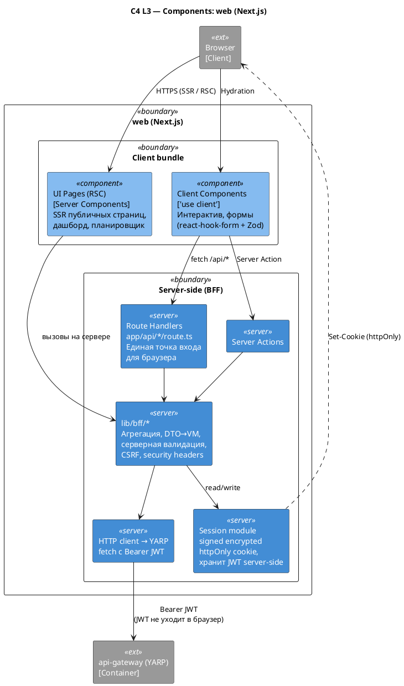

# C4 Component — Frontend (web)

Источник: ADR-0015, ADR-0017, AR-0010

## Описание

Внутреннее устройство контейнера `web` (Next.js): граница между client-кодом (UI) и серверным BFF-слоем. Браузер ходит только в Route Handlers `/api/*`; `lib/bff/*` и модуль сессии — серверные, никогда не импортируются из client. JWT не покидает сервер: в браузер уходит только httpOnly signed encrypted cookie.

## Диаграмма

