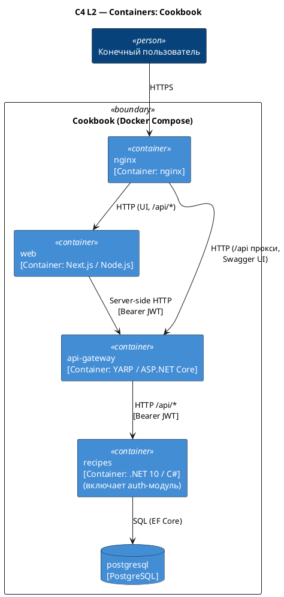

# C4 Containers — Cookbook

Источник: ADR-0007, ADR-0008, ADR-0010, ADR-0015, ADR-0017, ADR-0020, ADR-0035

## Описание

Контейнерная диаграмма стека, разворачиваемого через Docker Compose. Наружу опубликован только nginx; за ним — Next.js (UI + BFF в одном процессе) и YARP (API Gateway). YARP является чистым прокси и маршрутизирует к `recipes`-сервису. `recipes`-сервис содержит модуль аутентификации и выпускает JWT. Одна PostgreSQL для всех данных.

## Диаграмма

