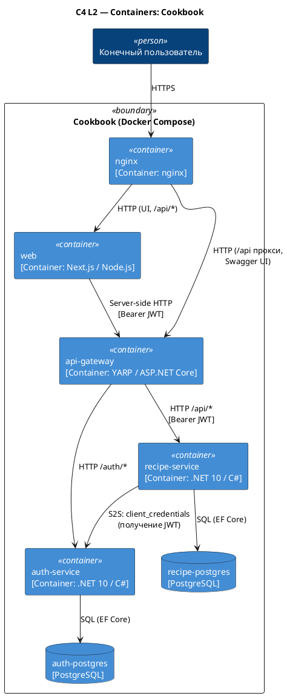

# C4 Containers — Cookbook

Источник: ADR-0007, ADR-0008, ADR-0010, ADR-0015, ADR-0017, ADR-0020, ADR-0021

## Описание

Контейнерная диаграмма стека, разворачиваемого через Docker Compose. Наружу опубликован только nginx; за ним — Next.js (UI + BFF в одном процессе) и YARP (API Gateway). YARP маршрутизирует к auth-service и доменным backend-сервисам. У каждого сервиса своя БД PostgreSQL; если в одном сервисе несколько bounded contexts — они разделяются схемами. Единственный issuer JWT — auth-service.

## Диаграмма

