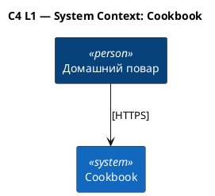

# C4 Context — Cookbook

Источник: ADR-0008

## Описание

Системный контекст «Книги рецептов». Единственный внешний актор — конечный пользователь в браузере; внешних интегрируемых систем у MVP нет.

## Диаграмма

