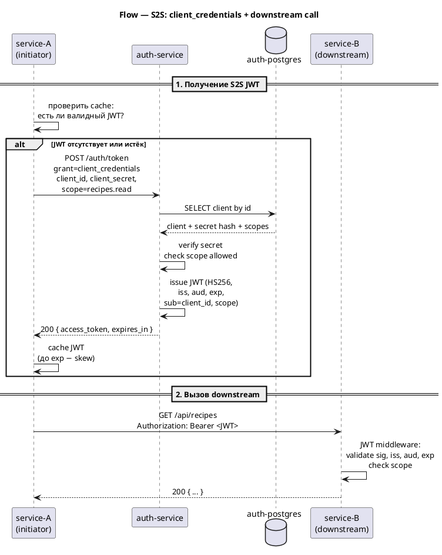

# Flow — S2S через OAuth 2.0 client_credentials

Источник: ADR-0022, AR-0012, AR-0013

## Описание

Sequence-диаграмма межсервисного вызова. S2S-трафик идёт по внутренней сети Docker Compose **напрямую**, в обход YARP (API Gateway — точка входа для внешних клиентов, а не для backend↔backend). Сервис-инициатор получает JWT у auth-service по grant `client_credentials`, кэширует его до истечения `exp`, и зовёт downstream-сервис напрямую с `Authorization: Bearer`. Downstream-сервис валидирует JWT тем же middleware, что и пользовательский (общий issuer и формат токена).

## Диаграмма

