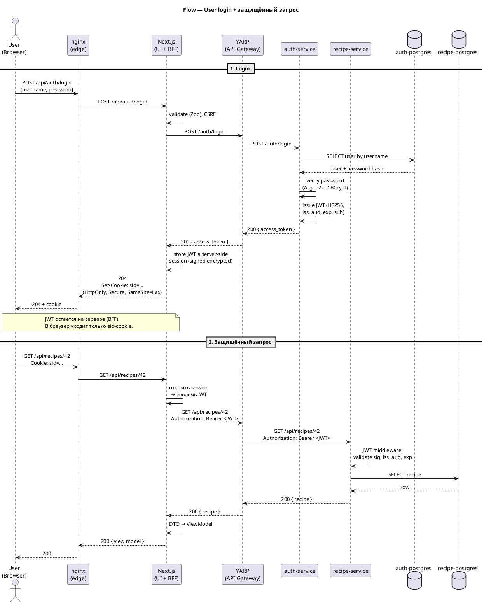

# Flow — User login + защищённый запрос

Источник: ADR-0005, ADR-0017, ADR-0021, AR-0010, AR-0012, AR-0013

## Описание

Sequence-диаграмма пользовательского логина и последующего вызова защищённого ресурса. Браузер отправляет credentials в BFF (Next.js Route Handler); BFF проксирует на YARP → auth-service, получает JWT, кладёт его в server-side session и возвращает браузеру только httpOnly signed encrypted cookie. На последующих запросах JWT не покидает сервер: BFF читает его из session и добавляет Bearer на сторону YARP. Доменный сервис самостоятельно валидирует JWT.

## Диаграмма

